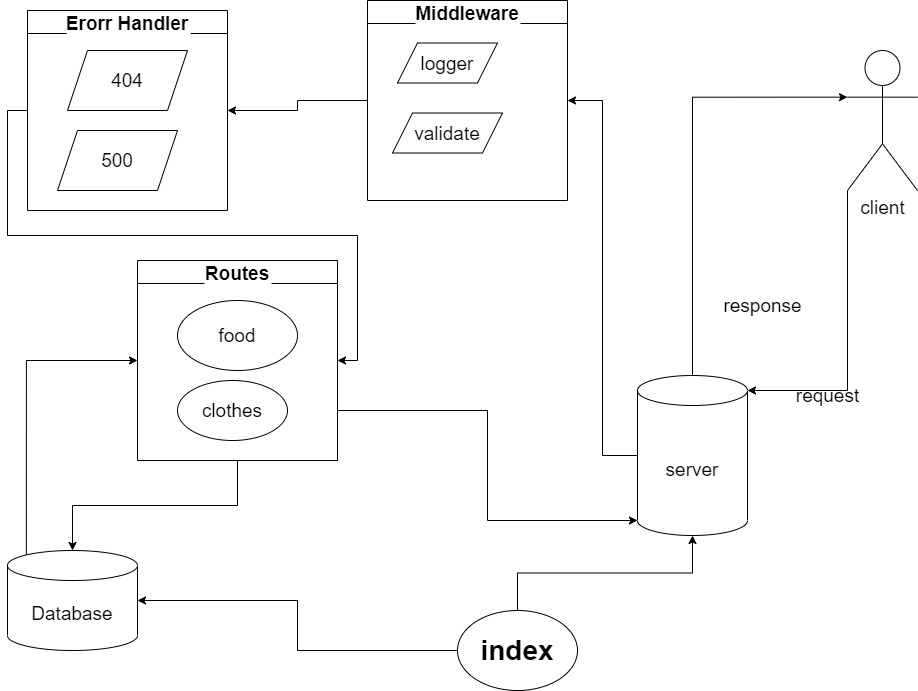

**Author** : _Khalid Hamedi_

[GitHub Repo Link](https://github.com/khalidsy90/basic-api-server)
[Pull Request](https://github.com/khalidsy90/basic-api-server/pulls)
[GitHub ACTION](https://github.com/khalidsy90/basic-api-server/actions)
[Heroku](https://khalid-basic-api-server.herokuapp.com/)

**Dependencies** :
sqlite3
dotenv
express
jest
pg
sequelize
supertest

**Routes**

- POST _createClothes_ http://localhost:3030/clothes
- GET _allClothes_ http://localhost:3030/clothes
- GET _oneClothes_ http://localhost:3030/clothes/1
- PUT _updateClothes_ http://localhost:3030/clothes/1
- DELETE _DestroyClothes_ http://localhost:3030/clothes/1
- POST _createFood_ http://localhost:3030/food
- GET _allFood_ http://localhost:3030/food
- GET _oneFood_ http://localhost:3030/food/1
- PUT _updateFood_ http://localhost:3030/food/1
- DELETE _DestroyFood_ http://localhost:3030/food/1

---

UML

